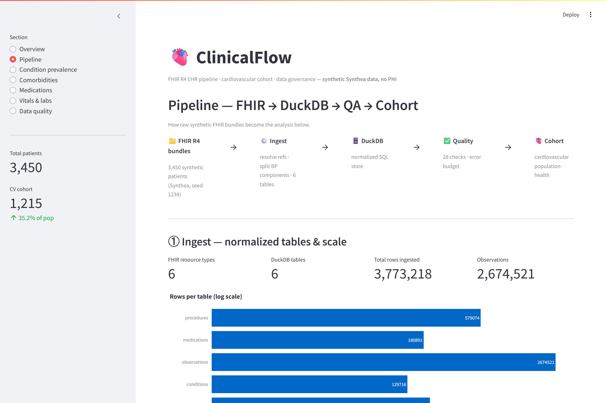
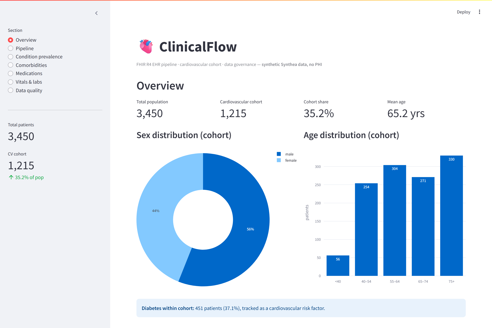
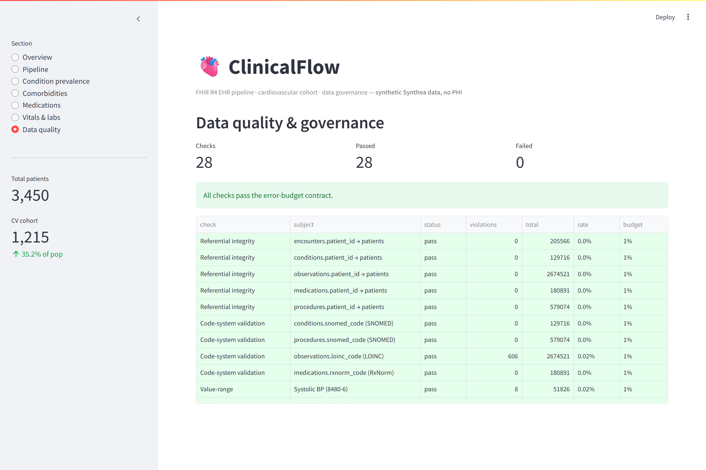
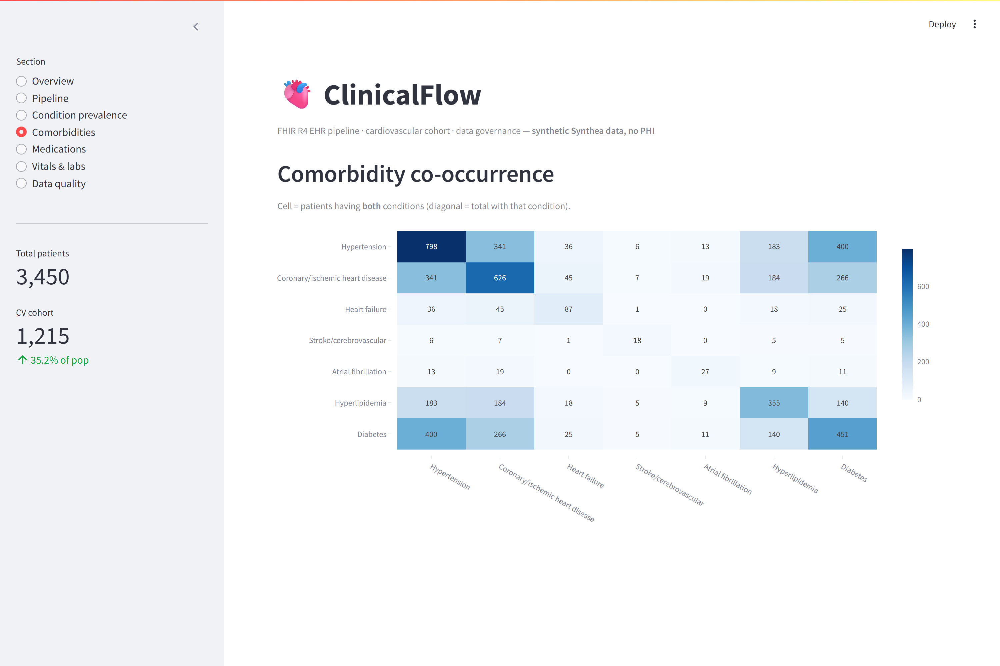
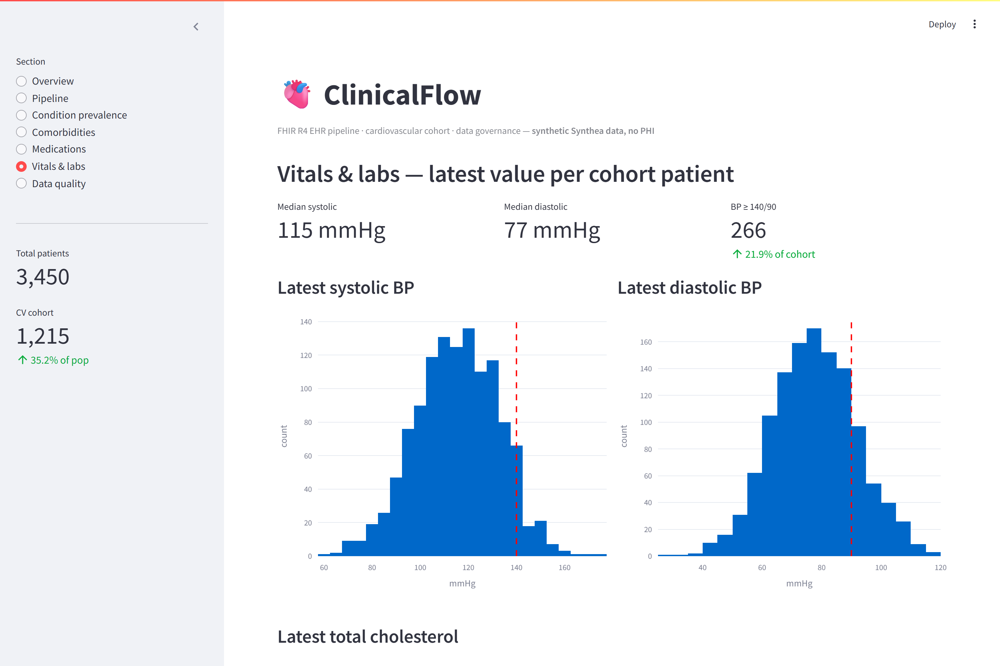

# ClinicalFlow

**FHIR-based EHR pipeline and cardiovascular cohort analysis.**

ClinicalFlow ingests synthetic electronic health records in **HL7 FHIR R4** format,
builds a reproducible data-processing and **quality-assurance** pipeline over them
(loading them into a SQL-queryable **DuckDB** store), and analyzes a **cardiovascular
cohort** for population-health insights — all surfaced through an interactive
**Streamlit** dashboard. It runs end to end from raw FHIR bundles to a populated
database, a data-quality report, and a cohort summary with a single command.

> ⚠️ **Synthetic data only.** All patient data is generated by
> [Synthea](https://github.com/synthetichealth/synthea) and contains **no real
> patients and no PHI**. Nothing here is derived from real clinical records.

---

## ▶️ Live demo

**[Open the live dashboard](https://YOUR-APP.streamlit.app)** — no install required.
Hosted on Streamlit Community Cloud and backed by a small committed "slim"
database, so a recruiter can explore the pipeline, data-quality checks, and
cardiovascular cohort interactively in the browser. *(Replace the URL above with
your deployed app link — see [Deployment](#deployment).)*



## What this build contains

| | |
|---|---|
| Patients | **3,450** synthetic (3,000 living + 450 deceased), Massachusetts, Synthea seed `1234` |
| Store | DuckDB — 6 normalized tables (`patients`, `encounters`, `conditions`, `observations`, `medications`, `procedures`) |
| Scale | ~205k encounters, 130k conditions, **2.67M observations**, 181k medications, 579k procedures |
| Governance | **28 data-quality checks** across 6 families, error-budget contract — all passing |
| Cohort | **1,215** cardiovascular patients (**35.2%** of the population) |

---

## Prerequisites

Assumes a reviewer with neither tool configured:

- **Python 3.10+** (developed on 3.10.11).
- **Java 11+** — Java 17+ recommended (current Synthea needs 17+); required *only*
  to run the Synthea generator. Verified here on Java 25.

## Setup

```bash
python -m venv .venv
# Windows:   .\.venv\Scripts\Activate.ps1
# Unix/Mac:  source .venv/bin/activate
pip install -r requirements.txt
pip install -e .
```

Dependencies are pinned in `requirements.txt` for reproducibility.

## Running

This repo ships a `Makefile` (Unix/WSL/git-bash) **and** an equivalent `make.ps1`
for Windows PowerShell. Use whichever matches your shell:

| Task | Make (Unix) | PowerShell (Windows) |
|---|---|---|
| Install deps | `make setup` | `.\make.ps1 setup` |
| Get data | `make data` | `.\make.ps1 data` |
| Ingest | `make ingest` | `.\make.ps1 ingest` |
| QA | `make qa` | `.\make.ps1 qa` |
| Cohort | `make cohort` | `.\make.ps1 cohort` |
| **Full pipeline** | `make all` | `.\make.ps1 all` |
| Dashboard | `make dashboard` | `.\make.ps1 dashboard` |
| Tests | `make test` | `.\make.ps1 test` |

**One-command pipeline:** `make all` runs **ingest → qa → cohort** in sequence and
regenerates both reports. Then launch the dashboard with `make dashboard`.

---

## Getting the data

### Generator path (used here — reproducible)

`make data` is fully automated and idempotent: it shallow-clones Synthea into
`synthea/` (gitignored), generates with a fixed seed, and copies the FHIR R4
bundles into `data/raw/`. Re-running is a no-op unless you pass `--force`.

- **Seed** `1234` (population *and* clinician seed fixed) · **Population** `3000`
  living · **State** `Massachusetts`
- Produces **3,450** per-patient bundles (living + deceased) plus
  `hospitalInformation*` / `practitionerInformation*` bundles (non-target
  resources are skipped during ingest). ~14 GB raw JSON — **gitignored**.

Equivalent manual command inside the `synthea/` clone:

```bash
./run_synthea -p 3000 -s 1234 -cs 1234 Massachusetts
```

### Fast path (alternative)

If you don't want to run the generator, download a prebuilt Synthea FHIR sample
set from the [`synthea-sample-data`](https://github.com/synthetichealth/synthea-sample-data)
repo or [synthea.mitre.org/downloads](https://synthea.mitre.org/downloads), and
drop the FHIR JSON bundles into `data/raw/`. The rest of the pipeline is identical.

---

## Architecture

```
 raw FHIR bundles ─▶ ingest ─▶ DuckDB ─▶ QA checks ─▶ cohort analysis ─▶ dashboard
   (data/raw/)      (parse,    (6 tables)  (qa_results   (cv_cohort         (Streamlit)
                     resolve,              + report.md)   + summary.md)
                     normalize)
```

| Phase | Module | Output |
|---|---|---|
| 1 · Acquire | `acquire.py` | FHIR bundles in `data/raw/` |
| 2 · Ingest | `ingest.py`, `schema.py` | 6 normalized DuckDB tables |
| 3 · Quality | `quality.py` | `qa_results` table + `reports/data_quality_report.md` |
| 4 · Cohort | `cohort.py` | `cv_cohort` table + `reports/cohort_summary.md` |
| 5 · Dashboard | `app/dashboard.py` | Streamlit UI |
| — · Orchestrate | `pipeline.py` | `make all` runs ingest → qa → cohort |

**Notable FHIR handling in ingest:** references (`urn:uuid:` / `fullUrl` / `Type/id`)
are resolved to bare ids; polymorphic `value[x]` is normalized; multi-component
observations (e.g. blood pressure) are split into one row per component with a
unique id; codes are pulled from `coding[]` with the coding system tracked (LOINC
vs SNOMED vs RxNorm); mixed date forms are normalized to a single timestamp; and
`medicationReference` is resolved back to the bundle's `Medication` resource to
recover the RxNorm code.

---

## Data quality & governance

`quality.py` runs a check suite and applies an **error-budget contract**: a check
**fails when violations exceed 1%** of the rows it inspects (configurable in
`config.py`). Results are written both machine-readable (a DuckDB `qa_results`
table) and human-readable (`reports/data_quality_report.md`).

| Family | What it verifies |
|---|---|
| Referential integrity | every child `patient_id` resolves to a real patient |
| Code-system validation | SNOMED (conditions/procedures), LOINC (observations), RxNorm (medications) present & well-formed |
| Value-range | vitals/labs within configurable bounds (e.g. systolic 50–300, cholesterol 50–500) |
| Completeness | null rate of required fields (birth_date, gender, observation value, condition code) |
| Temporal sanity | no future/illogical dates; events after birth; death after birth |
| Duplicates | no duplicate resource ids per table |

Thresholds and value-range bounds live in `config.py`, not inline.

---

## Cohort analysis

The cohort is defined by **querying the distinct condition codes actually present
in the data**, then mapping the cardiovascular ones (hypertension, coronary/
ischemic heart disease, heart failure, stroke/cerebrovascular disease, atrial
fibrillation, hyperlipidemia). Diabetes is tracked as a comorbidity/risk factor.
`reports/cohort_summary.md` reads as a short population-health brief: cohort size
and share, age/sex distribution, per-condition prevalence, a comorbidity
co-occurrence matrix, medication-class prevalence (statins, antihypertensives,
anticoagulants/antiplatelets), latest BP/cholesterol distributions, and a
population-health flag for patients with a latest BP ≥ 140/90.

---

## Dashboard

`streamlit run app/dashboard.py` (or `make dashboard`). Seven sections, all reading
read-only from DuckDB with cached queries: **Overview**, **Pipeline** (the
FHIR→DuckDB→QA→cohort flow, ingest scale, and cohort funnel), **Condition
prevalence**, **Comorbidities** (heatmap), **Medications**, **Vitals & labs**
(distributions), and **Data quality** (the pass/fail governance table). It uses
the full local DB when present and automatically falls back to the committed slim
demo DB otherwise (so the hosted app works without the 160 MB database).

| Overview | Data quality |
|---|---|
|  |  |
| **Comorbidities** | **Vitals & labs** |
|  |  |

Screenshots are regenerated with `python scripts/capture_screenshots.py` against a
running server (requires `pip install playwright && playwright install chromium`).

---

## Deployment

The app is deploy-ready for **Streamlit Community Cloud** (free):

1. Push this repo to GitHub (must be **public** for the free tier).
2. Go to [share.streamlit.io](https://share.streamlit.io) → **New app**.
3. Pick this repo, branch `main`, main file `app/dashboard.py`.
4. Deploy. Streamlit installs `requirements.txt`; the app imports the package via a
   `src/` path shim (no editable install needed) and reads the committed
   `data/clinicalflow_slim.duckdb`.

Rebuild the slim demo DB after a fresh pipeline run with `make slim`
(`.\make.ps1 slim`) — it extracts only cohort-relevant rows plus a
`pipeline_stats` table carrying the true full-scale counts.

---

## Testing

```bash
make test        # or  .\make.ps1 test
```

`pytest` covers ingestion (against a hand-checked fixture bundle including a
multi-component blood-pressure observation and `medicationReference` resolution),
the QA checks (known-bad rows must fail the right checks), and cohort membership
and a prevalence number.

---

## Project structure

```
clinicalflow/
  src/clinicalflow/   config, schema, acquire, ingest, quality, cohort, report, pipeline
  app/dashboard.py    Streamlit app
  tests/              pytest suite + fixtures/sample_bundle.json
  reports/            generated: data_quality_report.md, cohort_summary.md
  data/               raw/ (gitignored) + clinicalflow.duckdb (gitignored)
  Makefile / make.ps1 task runners
```

`data/raw/`, `*.duckdb`, and the `synthea/` clone are gitignored — **no data files
are committed**.

---

## What it demonstrates

- A reproducible Python pipeline that ingests, integrates, and normalizes HL7
  FHIR R4 EHRs (Patient, Encounter, Condition, Observation, MedicationRequest,
  Procedure) for several thousand synthetic patients into a SQL-queryable DuckDB store.
- A data governance / QA layer — cross-resource referential-integrity checks,
  LOINC/SNOMED/RxNorm validation, value-range and missingness checks, error-budget
  thresholds — producing a compliance-style data-quality report.
- A defined cardiovascular cohort with prevalence, comorbidity, and treatment-pattern
  analysis for population-health research, surfaced through an interactive dashboard.

**Skills:** FHIR (R4), HL7, EHR, Healthcare Interoperability, Clinical Data,
Population Health, Cohort Analysis, Data Governance, Data Quality Assurance, Streamlit.
